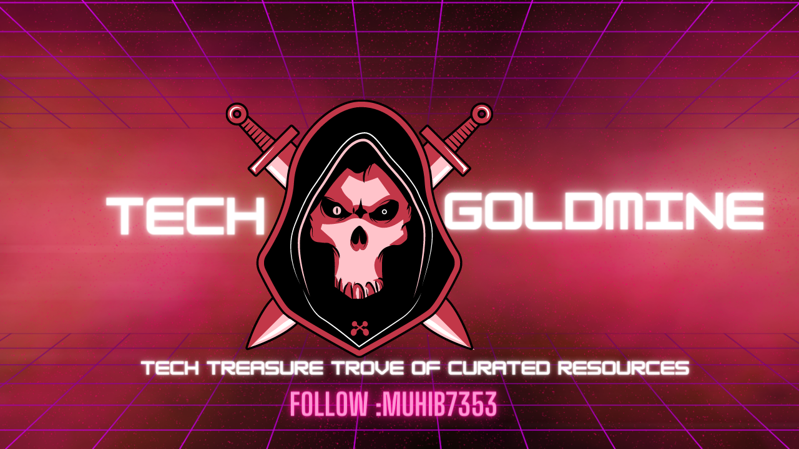

  

 
<h1 align="center" style="font-size: 80px;" > TECH GOLDMINE</h1>

 

> Tech Goldmine is a one-stop shop for all your tech needs, featuring curated lists of the best Chrome extensions, VSCode extensions, software, web apps, shortcut keys ,develpor-communities, and other useful techniques and resources. With Tech Goldmine, you'll have everything you need to stay up-to-date and improve your productivity and efficiency in the tech world.

# 🤝 Contributing

"Feel free to contribute to this repository. If you want to add new features or resolve any issues, you can fork the repository and make changes to the code. If you only want to make changes to the file, you can create a pull request to the master branch. I will review it and, if it meets the necessary requirements, I will merge it into the branch. The same process applies for changes to the main branch as well.

And when you want to add something new and pull request follow the instructions in the [CONTRIBUTING File](/CONTRIBUTING.md).
"

# About me

### 👨‍💻 Muhib Arshad

   

Let's connect!

## Show your support

If this project was helpful to you, please consider giving it a ⭐️.
You can also follow my GitHub profile to stay updated on my latest projects:
<a href="https://github.com/muhib7353" target="blank">
@muhib7353
</a>

## 📝 License

Copyright © 2023 [Muhib Arshad](https://github.com/muhib7353).

This project is [MIT](https://github.com/muhib7353/Tech-Goldmine/blob/main/License.md) licensed.
